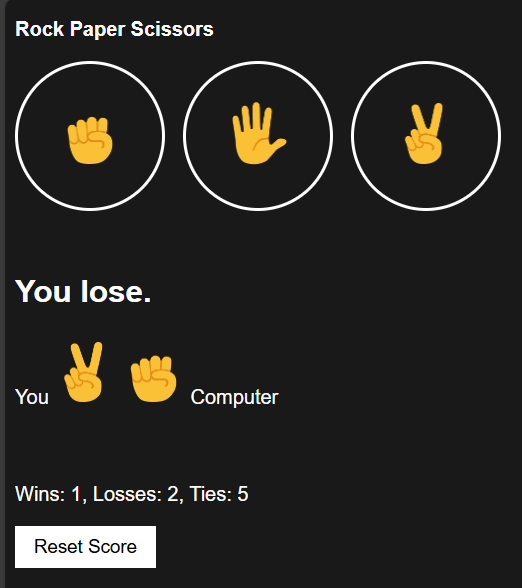

# 🪨📄✂️ Rock Paper Scissors (Stage 2 – Score Tracking)

This is the **Stage 2** version of my Rock Paper Scissors project.  
Unlike Stage 1 (which only used alerts), this version **displays results directly on the page** and adds **score tracking with persistence**.  

---

## ✨ Features
- 🎮 **Interactive Gameplay** – Choose Rock, Paper, or Scissors.  
- 🤖 **Random Computer Move** – Selected with `Math.random()`.  
- 📊 **Score Tracking** – Wins, losses, and ties are counted.  
- 💾 **Local Storage Support** – Score persists even after refreshing the page.  
- 🔄 **Reset Button** – Clears the score and localStorage.  
- 🎨 **Improved UI** – Styled buttons, result section, and move icons.  

---

## 📸 Screenshot Preview
Here’s how the UI looks:  

  

---

## 🚀 Demo
Play it live here 👉 [Rock Paper Scissors – Stage 2](https://harikareddi13.github.io/RockPaperScissors-MediumVersion/)  

---

## 🛠️ Tools & Technologies Used
- **HTML5** – Page structure.  
- **CSS3** – For styling buttons, results, and layout.  
- **JavaScript (Vanilla JS)** – Game logic:
  - Handling player choices with `onclick`.  
  - Using `Math.random()` for computer moves.  
  - Updating score dynamically in the DOM.  
  - Storing score in `localStorage`.  

---

## 📚 Things I Learned
- How to **update the DOM dynamically** with `innerHTML`.  
- Using **localStorage** to save game state.  
- Designing a **reset feature** to clear data.  
- Basics of **UI/UX improvements** in small games.  

---

## ⚡ How to Access / Run

🎮 **Play Online**: [Rock Paper Scissors – Stage 2](https://harikareddi13.github.io/RockPaperScissors-MediumVersion/)  

💻 **Run Locally**:  
1. Clone this repository:
   ```bash
   git clone https://github.com/Harikareddi13/RockPaperScissors-MediumVersion.git
